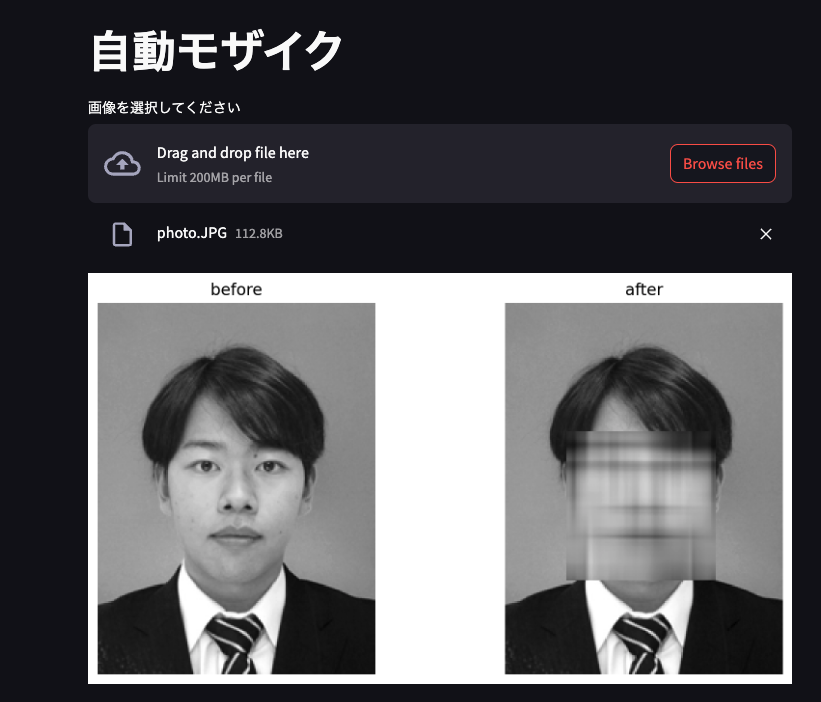

# Face Mosaic App
streamlitで作成した顔モザイクアプリ
- 顔を切り取り、高速フーリエ変換で写真をぼかしている。

ライブラリ
```python
import streamlit as st
import numpy as np
import matplotlib.pyplot as plt
from scipy.fft import fft2, ifft2, fftshift
from PIL import Image, ImageDraw

import face_recognition
import cv2
```
sample
